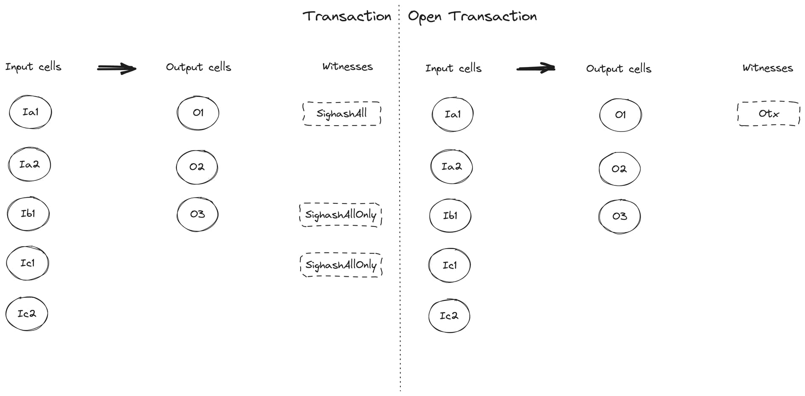
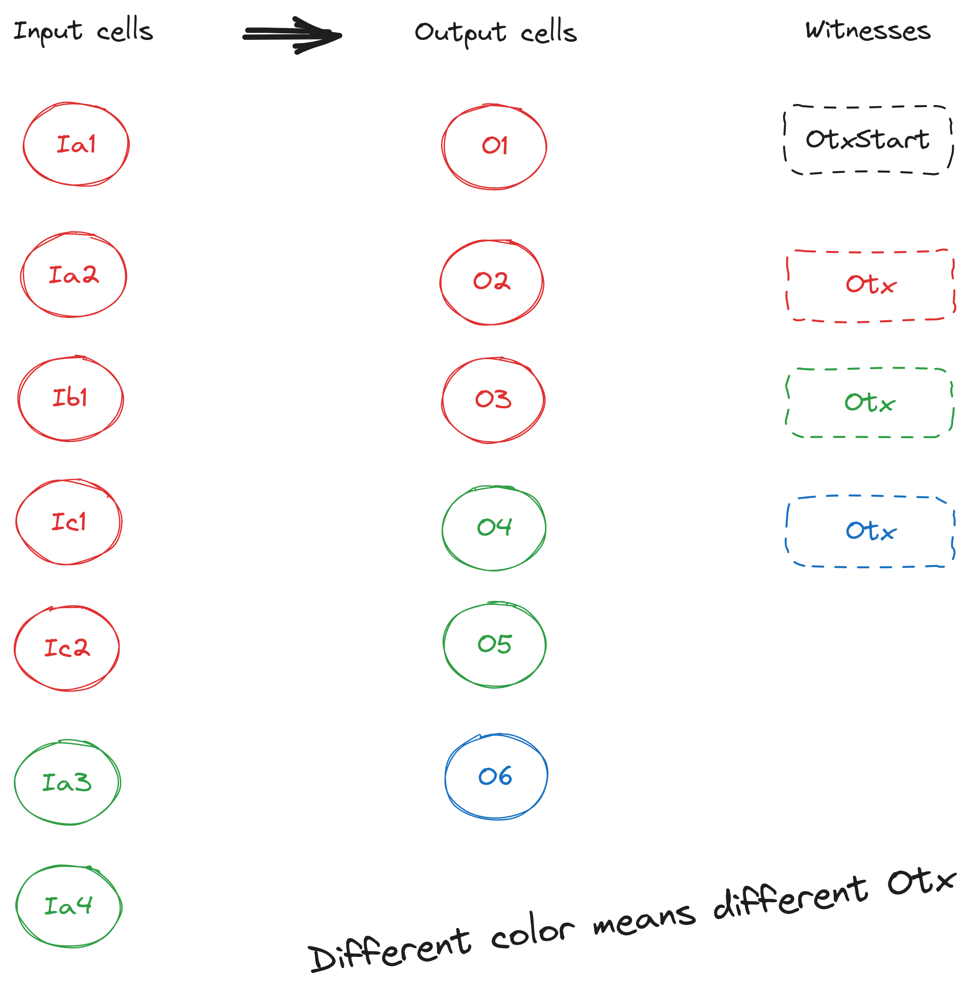
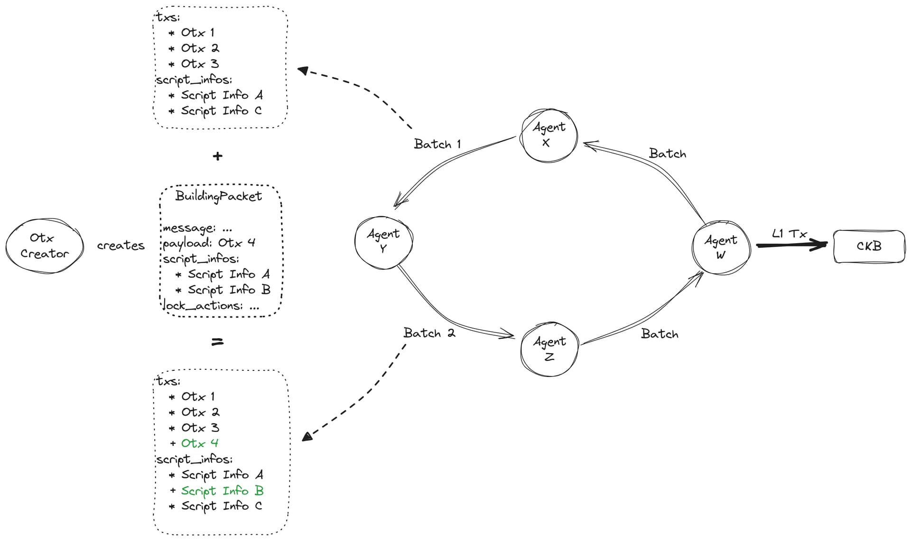
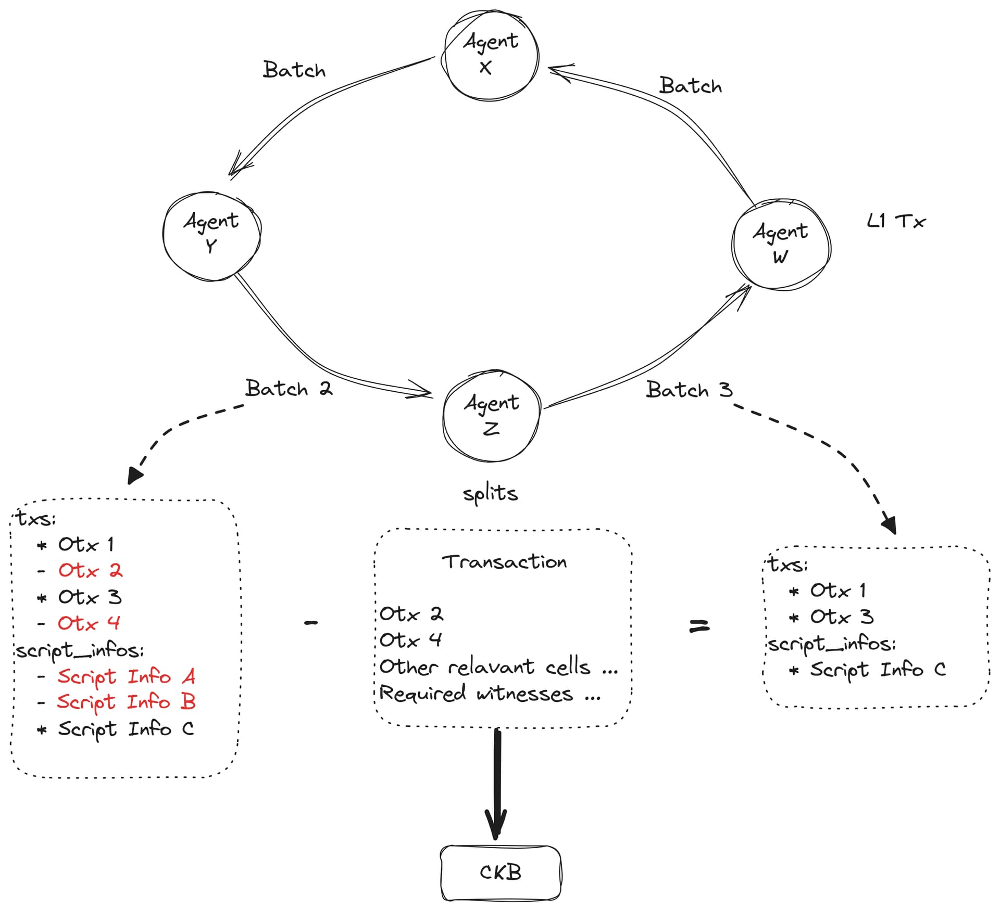
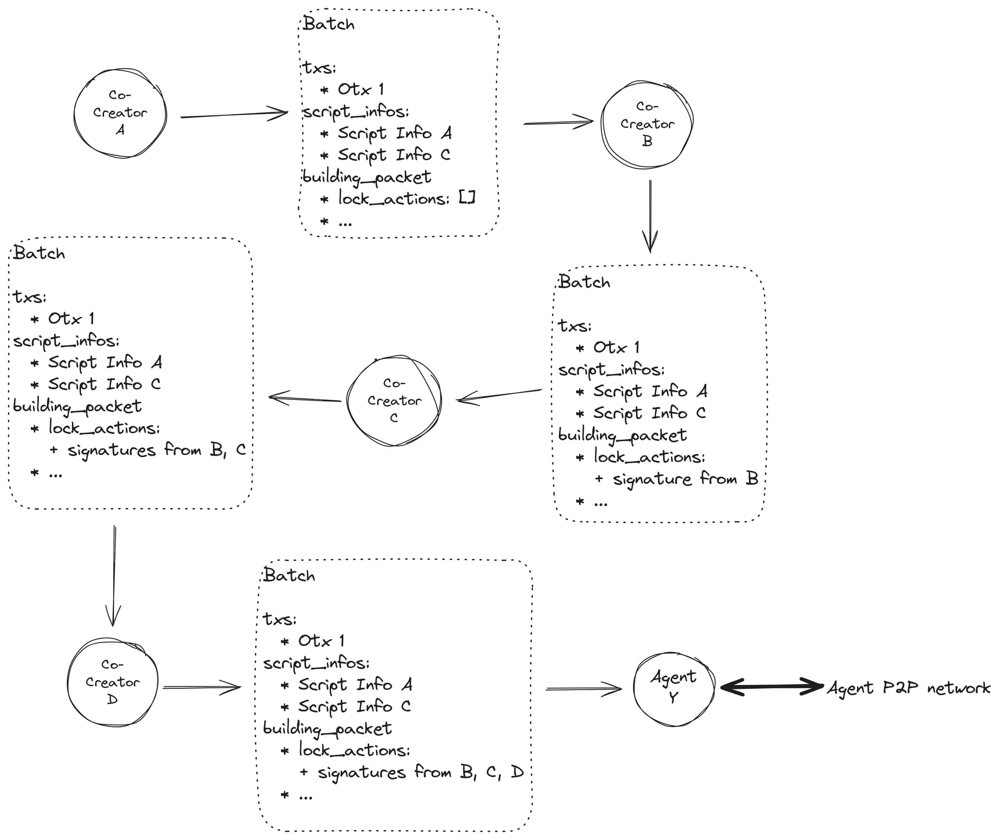

# CKB Open Transaction (OTX) CoBuild Protocol Overview

**Author:** xxuejie  
**Date:** Feb 2024  
**Thanks to:** Jan Xie, Quake Wang, Ian Yang, Jiandong Xu for early review, PoCs, and feedback

## Overview

We tried a finer-grained prototype design of open transaction earlier. An open transaction could be in many different forms following this design, making it extremely difficult to ensure the safety of multiple combined otxs in arbitrary environment. In the mean time, it occurred to us that most scenarios where open transactions are required, could be simplified to a handful of patterns. This might result in a better and safer choice with a coarser-grained design, that reduces the flexibility but still manage to satisfy the requirements of different scenarios.

A new open transaction protocol, named CoBuild Open Transaction(OTX) is thus built from the idea of simplification discussed above, combining with the newly designed CoBuild protocol. CoBuild OTX has the following properties:

- An Otx shares the exact same structure as a typical CKB Transaction, a CoBuild Otx has input / output cells, cell / header deps, and a single witness.
- The signature of an Otx prevents the unwanted manipulations of all input / output cells, cell / header deps, and the sole witness(excluding the signature itself) in this particular Otx.
- No matter how many lock scripts are included in an Otx, an Otx has only a single witness.
- An Otx will first be encapsulated in a full CKB Transaction, then gets committed on chain. The location (in the full CKB Transaction) of the witness field for an Otx, has nothing to do with the location of input / output cells (in the full CKB Transaction) of the Otx. This is quite different from typical CKB Transaction, where a witness is tied to input / output cells of the same index in the CKB Transaction.
- The relative order of input cells (nor output cells) within an Otx must not be changed. However, different Otxs can be packed in different orders withing a full CKB Transaction.
- Multiple Otxs must bee packed consecutively within a full CKB Transaction. In other words, any input cell / output cell / cell dep / header dep / witness that does not belong to any Otx, must not be placed in-between input cells / output cells / cell deps / header deps / witnesses that belong to Otxs packed in current CKB Transaction.
- For each entity (input cell / output cell / cell dep / header dep / witness) in a CKB Transaction, either it belongs to a particular Otx, or it does not belong to any Otx. For example, there must never be a cell whose lock script is performing sighash-style verification, where its type script is performing otx-style verification.




## Off-chain Construction

CoBuild OTX shared the exact same workflow as a CoBuild TX when constructing and signing a trnasaction. We can refer to the workflow in CoBuild protocol for more details. In addition to that, CoBuild OTX requires a separate workflow to collect and pack OTXs to full CKB Transaction. 2 parties would participate in this workflow:

- **Otx Creator:** Create and relay OTXs via a p2p network or other means. An Otx creator expects that an Otx agent would collect OTXs, then pack them with other OTXs together into full CKB Transactions, and committed to the CKB blockchain.
  - An Otx Creator can be a normal user working off a CKB app, or more sophisticated roles. Take a dex for an example, a market maker might construct Otx 100 as a taker tx, as a response to a series of maker Otx 1(2, 3, …) created by end-users. It is expected that Otx 1, 2, 3, … can be packed with Otx 100 into a single full CKB Transaction, satisfying all validation rules of all CKB scripts included. The maker maker will act as an Otx Creator here.

- **Otx Agent:** Collect and relay OTXs via a p2p network or other means. An Otx Agent would also look for a series of Otxs that can satisfy script validation rules, pack those Otxs into a single full CKB Transaction, send it to CKB P2P network, and eventually committed to CKB blockchain.
As mentioned, on-chain scripts determines the criteria for packing Otxs. For example, some Otxs might supplement each other’s validation rules. In other cases, a timing or spacing threshold would be used so a batch of multiple Otxs can be packed together can committed on chain.
The final Otx Agent for packing a series of Otxs together, might add one or more input cells(and corresponding output cells) owned by the agent themselves to the transaction. Those input cells could serve 2 purposes: fees for the CKB Transaction can be provided via those cells, the input cell can also leverage SighashAll mode WitnessLayout structure introduced in CoBuild protocol to lock the generated CKB Transaction, ensuring that no one can alter the CKB Transaction after packed and signed.
CoBuild OTX leverages the following data structure off-chain:

```c
option BuildingPacketV1Opt (BuildingPacketV1);

table OtxBatchV1 {
		txs: TransactionVec,
		building_packet: BuildingPacketV1Opt,
		script_infos: ScriptInfoVec,
}

union OtxBatch {
		OtxBatchV1,
}
```
A single CoBuild OTX is the smallest unit in CoBuild universe to represent a single user’s operation. Multiple Otxs are committed to CKB blockchain in batches, each CKB Transaction could contain multiple correlated Otxs. OtxBatchV1 can be used to hold multiple correlated CoBuild Otxs before committing to the CKB blockchain.

### Agent P2P Network


An OtxBatchV1 structure, including one or more CoBuild Otxs, might be relayed among Otx Agents via p2p network or other means. As the above chart illustrates, the Batch 1 relayed from Agent X to Agent Y includes 3 Otxs(Otx1, Otx 2 and Otx 3), as well as 2 script infos (A, C) used in CoBuild message part of the 3 Otxs. Script infos provides everything that is needed to supplement the Otxs included in a Batch.

Assuming an Otx Creator constructs and signs Otx 4, the Otx Creator can send a BuildingPacket structure containing Otx 4 to Agent Y, Agent Y can then extracts Otx 4 from the BuildingPacket, together with script info A, script info B required by Otx 4. Those information is then merged into Batch 1, creating Batch 2 which include 4 Otxs(Otx 1, Otx 2, Otx 3 and Otx 4), and 3 script infos (A, B, C), the BuildingPacket can now be discarded(message and lock_action in BuildingPacket won’t be needed). Agent Y can then start to relay Batch 2 to other agents.

In reality, more than one Otx Agent might be interested in a particular type of Otx, such as Otx 4 above, and they will also be processing Otx 4 the same way as Agent Y. There might be different “topics” in the network of Otx Agents, an Otx Agent could subscribe to a particular topic, and focus only one one type of Otxs, while other agents might be interested in and processing other kinds of Otxs.


Assuming Agent Z received Batch 2 after Agent Y broadcasts it, Agent Z now concludes that Otx 2 and Otx 4 in Batch 2 can be packed together, and committed to CKB blockchain. Agent Z then extracts Otx 2 and Otx 4, using them as a foundation to build a full CKB Transaction.

For the scripts included in Otx 2 and Otx 4 to succeed in validation, there might be other input / output cells that must be supplemented by Agent Z in the full CKB Transaction(e.g., fees at CKB level). There might also be other needs as to locating the correct cell deps, filling in required witnesses. Anyway, after a full CKB Transaction is constructed, Agent Z then relays the full CKB Transaction containing Otx 2 and Otx 4 to CKB’s P2P network, waiting for a miner to commit it on chain.

After broadcasting the full CKB Transaction, Agent Z has 2 choices for follow-up work:

1. **Construct Batch 3:** Agent Z then removes Otx 2 and Otx 4 from Batch 2, it also removes script info A & B which are not used anymore. It then relays Batch 3 containing the remaining Otxs to other agents. Hoping other agents would pick us Batch 3, then continue future work on the basis of Batch 3.

2. **Do nothing:** an agent in the Otx network might also monitor CKB's network, when an agent observes the fact that Otx 2 and Otx 4 are committed on CKB blockchain, it shall naturally remove Otx 2 and Otx 4 from its local states.
### Side track: is papp an Otx Creator, or is papp an Otx Agent?
A papp can be both an Otx Creator, and an Otx Agent. Using an orderbook based DEX as an example, 2 different scenarios would both work for market makers, pending on their exact behaviors:

1. A marker maker can choose to monitor all maker Otxs include in a Batch from an Otx Agent. It can then choose to create an Otx so as to take one or more maker Otxs. The market maker can relay the taker Otx it created to an Otx Agent. An Otx Agent then packs the final full CKB Transaction, which will be committed to the CKB blockchain. Here, we consider the market maker to be an Otx Creator

2. Note that an action to take orders, is not necessarily represented as a single Otx. The fundamental goal here, is to fulfill all validation rules in all CKB scripts(CKB / UDT), it's totally possible to fulfill maker Otxs by attaching input / output cells in SighashAll mode to the CKB Transaction. In this design, a market maker can choose to monitor maker Otxs relayed by other agents, pick those Otxs that it want to take, then construct a full CKB Transaction directly based on those selected Otxs. The taker side action is thus represented via input / output cells containing CKB / UDT in SighashAll mode. The market maker than send the full CKB Transaction directly to CKB P2P network, waiting for it to be committed on chain. Here, we consider the market maker to be an Otx Agent
### Otx construction in the context of other Otxs


Chances are multiple Otx Co-Creators will need to collaborate on the construction of a single CoBuild Otx. One example could be that a Spore NFT guarded by a multisig lock, when someone makes a bid for the Spore NFT via a CoBuild Otx, all the multisig parties owning the Spore NFT might need to collaborate and construct an Otx in the context of the bid Otx.

As the chart above illustrates, we can leverage building_packet field in Batch to fulfill this workflow. Multiple Otx Co-Creators now share a Batch structure containing the bid Otx 1, script info A & C required by Otx 1, and a BuildingPacket structure. Different Co-Creators can now exchange signatures by leveraging lock_actions field in BuildingPacket structure. When enough signatures are gathered, the Batch structure can then be relayed to an Otx Agent, which extracts bid Otx 1 from Batch as discussed above, and also extracts the Otx for accepting the offer from BuidingPacket. When both Otxs are merged into the agent’s own Batch structure, it can then choose between relaying the updated Batch to other agents, or construct a full CKB Transaction containing the 2 Otxs to be committed on CKB blockchain.

## On-chain Validation

We supplement the data structures in CKB Transaction CoBuild Protocol Overview with the following changes:

```c
// A full CKB Transaction can only contain one OtxStart structure, denoting the
// start for Otxs in the CKB Transaction. The include 4 fields here mark
// the starting indices of input cells, output cells, cell deps and header deps
// that belong to an Otx. There is no need to mark the starting index for Otx
// witnesses, since OtxStart itself already decides the starting index for Otx
// related witnesses.
//
// Several Otx structure would follow OtxStart structure in the witnesses array,
// each denoting a different Otx packed in current CKB Transaction.
table OtxStart {
    start_input_cell: Uint32,
    start_output_cell: Uint32,
    start_cell_deps: Uint32,
    start_header_deps: Uint32,
}

table SealPair {
    script_hash: Byte32,
    seal: ByteVec,
}
vector Seals <SealPair>;

// Otx structure denotes an Otx included in the Transaction, each Otx has exactly
// one Otx structure in the witnesses array. The index of a particular Otx witness
// in the witnesses array, has nothing to do with the indices of input / output
// cells that belong to this particular Otx.
table Otx {
		// Assuming an Otx has 3 input cells, those 3 input cells might choose to use
		// different lock scripts, signed by different signature verfication algorithms.
    // Following the above discussion, an Otx has a single Otx witness structure.
		// We need a way here to keep multiple signatures for different lock scripts
		// in a single witness.
		// This is why seals is designed in the way it is, each SealPair in Seals
		// resembles Action in the CoBuild message definition. We use script_hash
		// included in SealPair to distinguish among different lock scripts. A lock
		// script will first find a SealPair whose script_hash matches its own lock
		// script hash, then exact the seal field from the correct SealPair, which
		// might contain the actual signature.
    seals: Seals,
		// input_cells is an integer number representing the number of input cells
		// belonging to current Otx.
    // output_cells / cell_deps / header_deps function in similar way.
    input_cells: Uint32,
    output_cells: Uint32,
    cell_deps: Uint32,
    header_deps: Uint32,
    message: Message,
}
```
